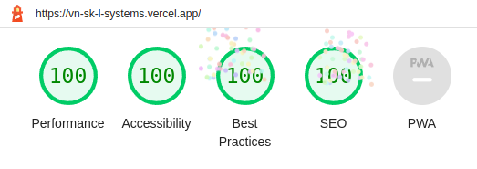

# L-Systems

**L-Systems** by:

- **Vyacheslav Novak - vj.novak9@gmail.com**
- **Srecko Kostic - srele96@gmail.com**.

## 🎉 Google Lighthouse score 🎉

After seeing the score, I am happy I spent two hours optimizing build 🥳🥳🥳

## Credits

Credits for brains, algorithms and technical knowledge go to **Vyacheslav Novak - vj.novak9@gmail.com**.

Credits for JavaScript, hosting and repository management go to **Srecko Kostic - srele96@gmail.com**.

## How the L-Systems Canvas implementation came to be

My friend **Vyacheslav Novak** completed the graphics assignments with the highest grade.

He created L-Systems in Java, I was very impressed. I got the idea after a while to do the JavaScript canvas implementation.

I didn't know the algorithms and logic behind them, Vyacheslav Novak did all the leadership work. I was merely his JavaScript tools to write, run and debug the code.
